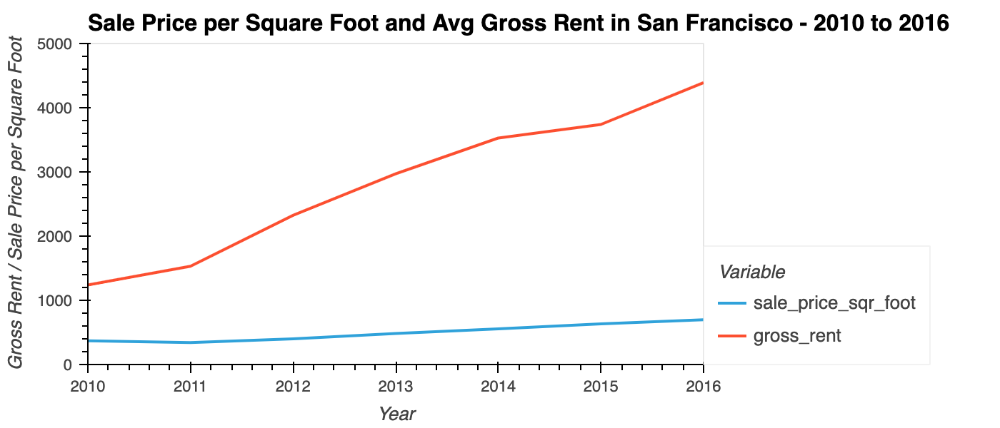
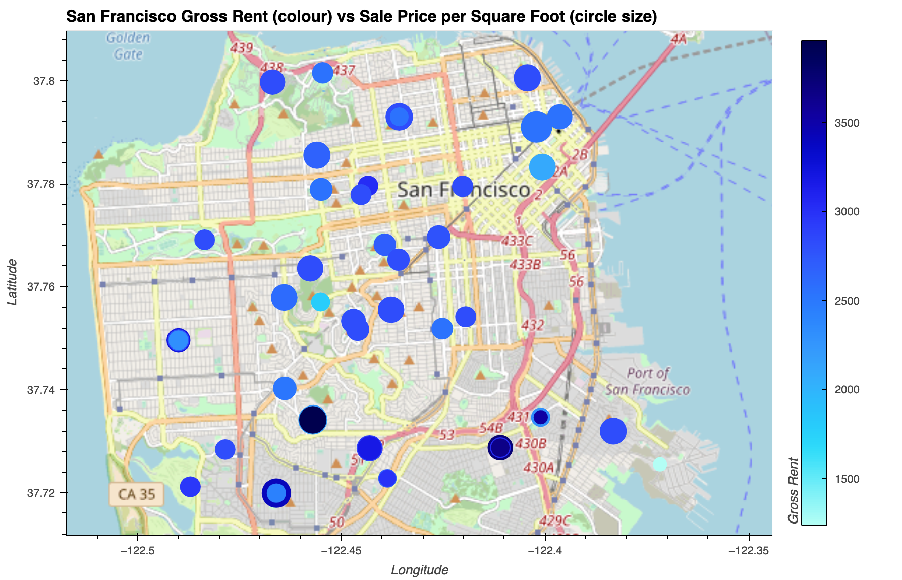

# Financial_Analysis_Challenge
Assignment #5, Module 6 Challenge Assignment

## Background for Assignment
**Proptech**, the application of technology to real-estate markets, is an innovative domain in the fintech industry. Assume that you’re an analyst at a proptech company that wants to offer an instant, one-click service for people to buy properties and then rent them. The company wants to have a trial of this offering in the San Francisco real estate market. If the service proves popular, they can then expand to other markets.

Your job is to use your data visualization skills, including aggregation, interactive visualizations, and geospatial analysis, to find properties in the San Francisco market that are viable investment opportunities.

For this homework assignment, you’ll need to create and submit the following deliverable:

* A Jupyter notebook that contains your analysis of the housing rental market data for San Francisco. The analysis will be complete with professionally styled and formatted interactive visualizations.

## Instructions
Original Instructions included in the Instructions.md file

## Analysis and Charts

### Housing Units in San Francisco from 2010 to 2016

### Sale Price per Square Foot and Avg Gross Rent in San Francisco from 2010 to 2016

### Sale Price per Square Foot and Avg Gross Rent by Neighbourhood in San Francisco from 2010 to 2016

This chart is interactive in the Jupyter Lab file.  You can choose different neighbourhoods from the dropdown on the right to see the details by neighbourhood.

### San Francisco Gross Rent vs Sale Price per Square Foot in in San Francisco from 2010 to 2016

